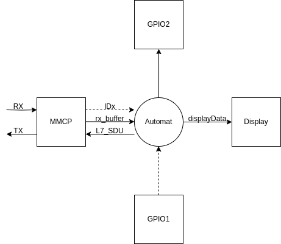
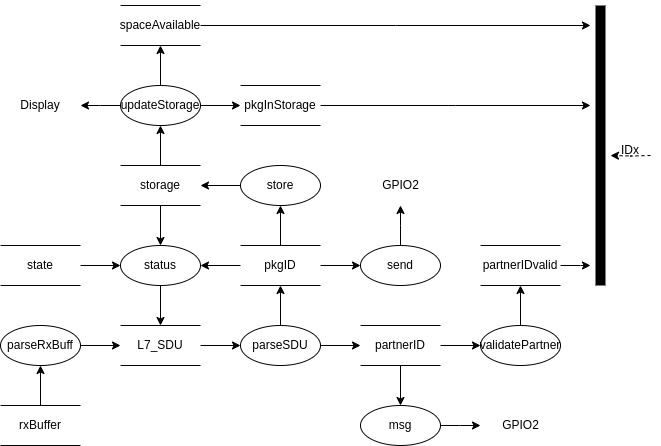
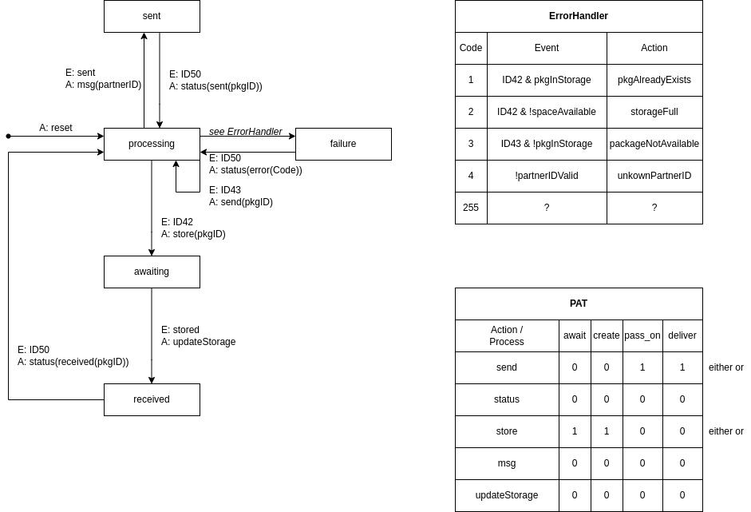

# ULP2: SA/RT-Modell für die Paketweiterleitung

Alle Diagramme wurden mit [draw.io](https://app.diagrams.net/) erstellt. Die Quelldatei ist [sart.drawio](./sart.drawio).

## Kontextdiagramm

## Datenflussdiagramm

## Minispezifikationen

- `msg`: initiates GPIO to inform partner with ID partnerID about pkg to receive
- `parseRxBuff`: parses rx_buffer
- `parseSDU`: parses L7_SDU
- `send`: initiates GPIO to send partner with ID partnerID pkg
- `status`: poll request
- `store`: writes pkgID to storage
- `updateStorage`: animates the pkg being stored on the display
- `validatePartner`: returns true if partnerID exists

## Zustandsautomat & Prozessaktivierungstabelle

